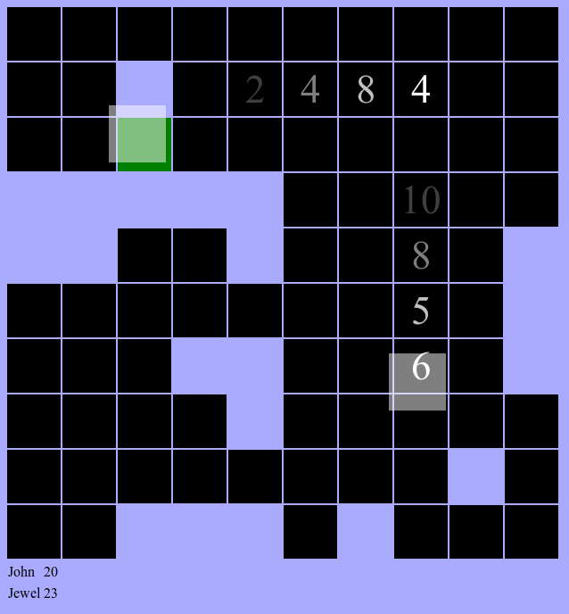

Speed Memory
============

This is a real-time, multiplayer HTML5 game.

It's like the game of memory, but all players play at once, and as fast as
possible.

This is a proof-of-concept of the idea of taking a turn-based game and making
it real-time.




Installation
------------

Install node.js and npm.

```bash
git clone https://github.com/jewel/speed-memory.git
cd speed-memory
npm install socket.io coffee-script
cake build
cd public/
node server.js
```

Then connect your browser to http://localhost:3000
